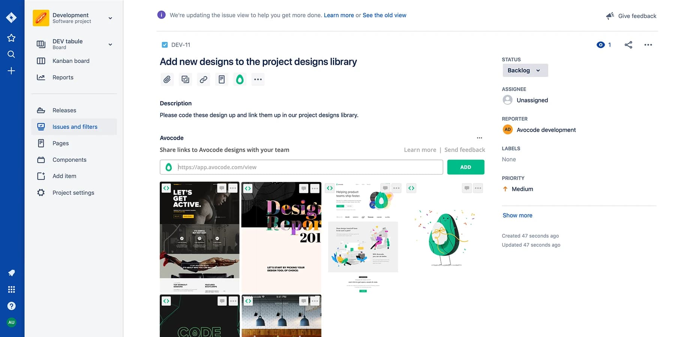

## Purpose

Back in 2019, I was an intern at Avocode. My task was to create integrations of Avocode into Atlassian products. I created integrations for Jira and Confluence. The goal was to optimize the hand-off process for Avocode users.

## Technologies

- React 16.8+ (hooks)
- Redux
- TypeScript
- Atlassian Jira and Confluence API

